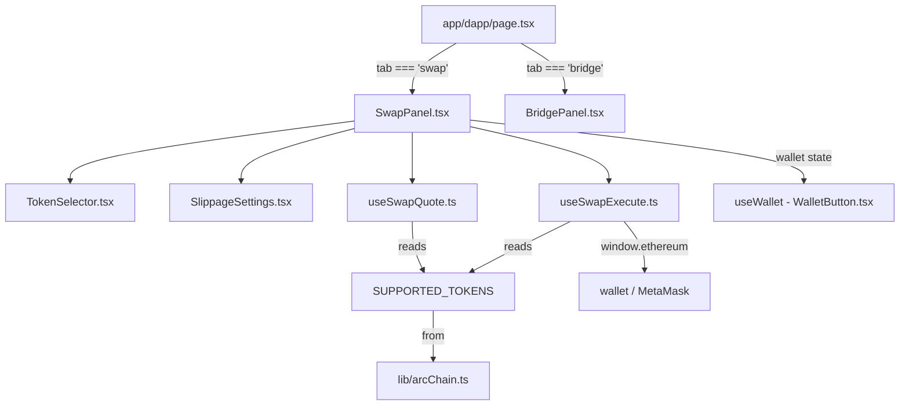
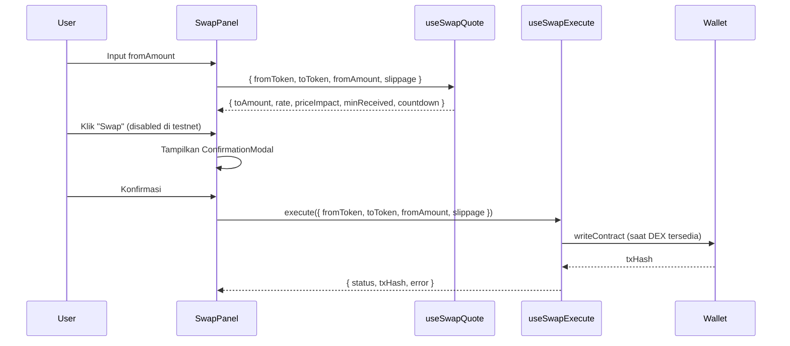

# Design Document — Swap Tab Feature

## Overview

Fitur ini menambahkan tab **Swap** yang tampil berdampingan dengan tab **Bridge** yang sudah ada di halaman `/dapp`. Karena DEX native belum tersedia di Arc Testnet, seluruh UI ditampilkan dalam **disabled/coming-soon state** dengan notifikasi yang jelas. Arsitektur dirancang agar mudah diaktifkan saat DEX tersedia di mainnet — cukup dengan mengganti flag `DEX_AVAILABLE` dan menghubungkan hook ke kontrak nyata.

### Tujuan

- Menampilkan tab Swap sejajar dengan tab Bridge tanpa mengubah layout yang sudah ada
- Menyediakan UI swap yang lengkap dan konsisten dengan design system zinc/emerald/sky
- Memisahkan logika quote dan eksekusi ke dalam custom hooks yang dapat diuji secara independen
- Menampilkan informasi swap yang informatif: rate, price impact, slippage, minimum received, countdown refresh

### Keputusan Desain Utama

1. **Coming-soon state**: Semua elemen interaktif dirender tapi dalam `disabled` state. Ini lebih baik daripada menyembunyikan UI karena pengguna dapat melihat fitur yang akan datang dan memahami alur swap.
2. **Pemisahan hook**: `useSwapQuote` menangani kalkulasi dan refresh, `useSwapExecute` menangani transaksi. Pemisahan ini memudahkan testing dan memungkinkan quote ditampilkan tanpa wallet terhubung.
3. **Token list terpusat**: Konstanta token didefinisikan sekali di `lib/arcChain.ts` dan digunakan oleh semua komponen.
4. **No DEX integration**: Tidak ada integrasi DEX nyata. Quote dihitung dari mock rates. Saat mainnet, hook cukup diganti implementasinya.

---

## Architecture



### Alur Data



---

## Components and Interfaces

### `components/SwapPanel.tsx`

Komponen utama yang mengorkestrasikan seluruh UI swap.

```typescript
// Props: tidak ada (standalone panel)
// Internal state:
interface SwapPanelState {
  fromToken: TokenSymbol        // default: 'USDC'
  toToken: TokenSymbol          // default: 'EURC'
  fromAmount: string            // input pengguna
  showSlippage: boolean         // toggle SlippageSettings
  showConfirmModal: boolean     // toggle ConfirmationModal
  isReversing: boolean          // animasi reverse button
}
```

**Sub-sections yang dirender:**
- Header dengan judul dan tombol ⚙️ (SlippageSettings)
- Coming-soon banner (selalu tampil di testnet)
- FROM field dengan TokenSelector
- ReverseButton (⇄) dengan animasi
- TO field dengan TokenSelector (read-only amount)
- Quote info row: rate, price impact, gas fee, minimum received
- QuoteRefresher countdown + tombol refresh manual
- Swap button (disabled di testnet)
- ConfirmationModal (conditional)

### `components/TokenSelector.tsx`

Modal/dropdown untuk memilih token.

```typescript
interface TokenInfo {
  symbol: TokenSymbol
  name: string
  address: `0x${string}`
  decimals: number
  logoChar: string   // emoji/karakter untuk logo sederhana
}

interface TokenSelectorProps {
  value: TokenSymbol
  onChange: (token: TokenSymbol) => void
  excludeToken?: TokenSymbol    // token yang tidak boleh dipilih (pasangan)
  balances: Record<TokenSymbol, string>
  disabled?: boolean
  label: string                 // "From" atau "To"
}
```

**Behavior:**
- Menampilkan daftar token dengan nama, simbol, dan saldo
- Token yang sama dengan `excludeToken` ditampilkan tapi tidak bisa dipilih (atau auto-swap)
- Menutup saat klik di luar modal

### `components/SlippageSettings.tsx`

Panel pengaturan slippage yang muncul saat ikon ⚙️ diklik.

```typescript
interface SlippageSettingsProps {
  value: string                 // nilai slippage saat ini (string untuk input)
  onChange: (value: string) => void
  disabled?: boolean
}

// Preset values
const SLIPPAGE_PRESETS = ['0.1', '0.5', '1.0'] as const
const DEFAULT_SLIPPAGE = '0.5'
const HIGH_SLIPPAGE_THRESHOLD = 5.0
```

**Behavior:**
- Preset buttons: 0.1%, 0.5%, 1.0%
- Custom input field
- Warning jika nilai > 5%
- Default: 0.5%

### `hooks/useSwapQuote.ts`

Custom hook untuk mengelola quote swap.

```typescript
interface SwapQuoteInput {
  fromToken: TokenSymbol
  toToken: TokenSymbol
  fromAmount: string
  slippage: string
}

interface SwapQuoteResult {
  toAmount: string              // estimasi output
  rate: number                  // 1 fromToken = rate toToken
  priceImpact: number           // persentase (0-100)
  priceImpactLevel: 'low' | 'medium' | 'high'  // < 1%, 1-3%, > 3%
  minReceived: string           // toAmount * (1 - slippage/100)
  gasFeeEstimate: string        // estimasi gas dalam format readable
  countdown: number             // detik hingga refresh berikutnya (0-15)
  isLoading: boolean
  refresh: () => void           // trigger manual refresh
  lastRefreshed: Date
}
```

**Auto-refresh:** `setInterval` setiap 15 detik, countdown didekremen setiap detik via interval terpisah.

### `hooks/useSwapExecute.ts`

Custom hook untuk mengeksekusi transaksi swap.

```typescript
interface SwapExecuteParams {
  fromToken: TokenSymbol
  toToken: TokenSymbol
  fromAmount: string
  minReceived: string
  slippage: string
}

interface SwapExecuteResult {
  execute: (params: SwapExecuteParams) => Promise<void>
  status: 'idle' | 'pending' | 'success' | 'error'
  txHash: string | null
  error: string | null
  reset: () => void
}
```

**Catatan:** Di testnet, `execute` akan throw error dengan pesan "DEX tidak tersedia di testnet". Saat mainnet, implementasi akan memanggil kontrak DEX.

---

## Data Models

### Token Types

```typescript
// lib/arcChain.ts sudah mengekspor address-address ini
// Kita tambahkan type dan konstanta di SwapPanel atau file terpisah

export type TokenSymbol = 'USDC' | 'EURC' | 'USYC'

export interface TokenInfo {
  symbol: TokenSymbol
  name: string
  address: `0x${string}`
  decimals: number
  logoChar: string
}

export const SUPPORTED_TOKENS: TokenInfo[] = [
  {
    symbol: 'USDC',
    name: 'USD Coin',
    address: ARC_USDC,           // '0x3600000000000000000000000000000000000000'
    decimals: 6,
    logoChar: '$',
  },
  {
    symbol: 'EURC',
    name: 'Euro Coin',
    address: ARC_EURC,           // '0x89B50855Aa3bE2F677cD6303Cec089B5F319D72a'
    decimals: 6,
    logoChar: '€',
  },
  {
    symbol: 'USYC',
    name: 'US Yield Coin',
    address: ARC_USYC,           // '0xe9185F0c5F296Ed1797AaE4238D26CCaBEadb86C'
    decimals: 6,
    logoChar: '⚡',
  },
]
```

### Mock Rates (Testnet)

```typescript
// Rates digunakan saat DEX tidak tersedia
// Production: fetch dari DEX router atau price oracle
const MOCK_RATES: Record<string, number> = {
  'USDC-EURC': 0.92,
  'EURC-USDC': 1.087,
  'USDC-USYC': 0.98,
  'USYC-USDC': 1.02,
  'EURC-USYC': 1.065,
  'USYC-EURC': 0.939,
}
```

### Quote Calculation

```typescript
// Kalkulasi dilakukan di useSwapQuote
function calculateQuote(
  fromAmount: string,
  rate: number,
  slippage: string
): { toAmount: string; minReceived: string; priceImpact: number } {
  const from = parseFloat(fromAmount) || 0
  const to = from * rate
  const slip = parseFloat(slippage) / 100
  const minReceived = to * (1 - slip)
  
  // Price impact: simulasi berdasarkan ukuran order
  // Production: dihitung dari pool liquidity
  const priceImpact = from > 100000 ? 3.5 : from > 10000 ? 1.5 : 0.05
  
  return {
    toAmount: to.toFixed(6),
    minReceived: minReceived.toFixed(6),
    priceImpact,
  }
}
```

### Tab State

```typescript
// Di app/dapp/page.tsx — sudah ada, tidak berubah
type Tab = 'bridge' | 'swap'
```

---

## Correctness Properties

*A property is a characteristic or behavior that should hold true across all valid executions of a system — essentially, a formal statement about what the system should do. Properties serve as the bridge between human-readable specifications and machine-verifiable correctness guarantees.*

### Property 1: Active tab styling invariant

*For any* tab value in `{ 'bridge', 'swap' }`, when that tab is the active tab, the corresponding button element MUST have the active CSS classes (`bg-zinc-800`, `text-zinc-100`), and the other tab button MUST have the inactive CSS classes (`text-zinc-500`, `hover:text-zinc-300`).

**Validates: Requirements 1.5, 1.6**

---

### Property 2: No identical token pair

*For any* token selection action where the user selects token T for the FROM field when the TO field already contains T (or vice versa), the system MUST automatically swap the other field so that `fromToken !== toToken` always holds after any selection.

**Validates: Requirements 2.7**

---

### Property 3: Token selector displays all required fields

*For any* list of tokens with associated balances, the rendered TokenSelector MUST display the name, symbol, and balance for every token in the list — no token entry may be missing any of these three fields.

**Validates: Requirements 2.4**

---

### Property 4: Quote calculation correctness

*For any* positive `fromAmount` value and any token pair `(fromToken, toToken)` with a known rate `r`, the displayed `toAmount` MUST equal `fromAmount * r` (within floating-point tolerance of 0.000001), and `minReceived` MUST equal `toAmount * (1 - slippage/100)`.

**Validates: Requirements 3.1, 3.5**

---

### Property 5: Rate display format

*For any* token pair `(FROM, TO)` with rate `r`, the rate display string MUST match the pattern `"1 FROM = r TO"` exactly, where FROM and TO are the token symbols and r is the numeric rate value.

**Validates: Requirements 3.2**

---

### Property 6: Slippage preset selection updates minimum received

*For any* preset slippage value `s` in `{ 0.1, 0.5, 1.0 }`, selecting that preset MUST result in: (a) that preset button being highlighted, and (b) `minReceived` being recalculated as `toAmount * (1 - s/100)`.

**Validates: Requirements 4.4**

---

### Property 7: High slippage warning threshold

*For any* slippage value `s`, if `s > 5.0` then a warning message MUST be displayed; if `s <= 5.0` then no warning MUST be shown. This boundary must hold for all numeric inputs including edge values like 5.0, 5.001, and 4.999.

**Validates: Requirements 4.5**

---

### Property 8: Price impact indicator color tier

*For any* price impact value `p`:
- If `p < 1.0`: indicator MUST use green styling and display ✓
- If `1.0 <= p <= 3.0`: indicator MUST use yellow styling and display ⚠️
- If `p > 3.0`: indicator MUST use red styling, display ✗, and include additional warning text

This classification MUST be consistent for all values of `p` including boundary values (exactly 1.0 and exactly 3.0).

**Validates: Requirements 6.1, 6.2, 6.3**

---

### Property 9: Reverse button swaps token pair

*For any* swap state with `(fromToken = A, toToken = B, fromAmount = x)`, clicking the ReverseButton MUST result in `(fromToken = B, toToken = A)`. The amounts may also be swapped (toAmount becomes the new fromAmount). After a second click, the state MUST return to `(fromToken = A, toToken = B)` — making reverse an involution (applying it twice returns to original state).

**Validates: Requirements 7.2**

---

### Property 10: Countdown decrements correctly

*For any* countdown value `N` where `0 < N <= 15`, after one second elapses the displayed countdown MUST be `N - 1`. When `N` reaches 0, the countdown MUST reset to 15 and a quote refresh MUST be triggered.

**Validates: Requirements 5.2, 5.4**

---

## Error Handling

### Wallet Not Connected

- Swap button renders as disabled with text "Connect wallet untuk swap"
- Quote calculation still runs (user can see rates without connecting)
- TokenSelector still opens and shows tokens (balances show "—")

### Wrong Network

- If `chainId !== ARC_CHAIN_ID`, show "Switch ke Arc Testnet" button (amber styling)
- Swap button is replaced by the switch button
- Quote still displays

### DEX Not Available (Current State)

- `DEX_AVAILABLE = false` constant controls this
- Coming-soon banner always shown: "Swap akan tersedia saat mainnet launch"
- All interactive elements rendered but `disabled`
- `useSwapExecute.execute()` returns early with a user-friendly error message
- No wallet calls are made

### Invalid Input

- Empty or zero `fromAmount`: Swap button disabled, `toAmount` shows "0.000000"
- Non-numeric input: Parsed as 0, same behavior as above
- Negative input: Treated as 0

### Quote Refresh Failure

- If mock rate lookup fails (unknown token pair): `toAmount` shows "—", error state in hook
- Auto-refresh continues regardless of previous failure
- Manual refresh button always available

### High Slippage

- Warning displayed inline in SlippageSettings when `slippage > 5%`
- Does not block the swap (user can proceed with high slippage when DEX is live)

---

## Testing Strategy

### Overview

This feature uses a **dual testing approach**: example-based unit tests for specific interactions and initial states, and property-based tests for universal invariants. Since the core logic (quote calculation, price impact classification, slippage validation) consists of pure functions, property-based testing is well-suited here.

**Property-based testing library:** [fast-check](https://github.com/dubzzz/fast-check) (TypeScript-native, works with Jest/Vitest)

### Unit Tests (Example-Based)

These cover specific scenarios, initial states, and interaction flows:

**`SwapPanel.tsx`**
- Renders with default tokens USDC (FROM) and EURC (TO)
- Shows coming-soon banner when `DEX_AVAILABLE = false`
- Swap button is disabled when wallet not connected
- Swap button is disabled when `DEX_AVAILABLE = false`
- Clicking ⚙️ toggles SlippageSettings visibility
- ConfirmationModal appears when Swap button clicked (future: when DEX available)
- ReverseButton is disabled when `busy = true`

**`TokenSelector.tsx`**
- Renders all three tokens (USDC, EURC, USYC)
- Closes when clicking outside the modal
- Excluded token is not selectable

**`SlippageSettings.tsx`**
- Default value is 0.5
- Three preset buttons render with values 0.1, 0.5, 1.0
- Custom input field is present

**`useSwapQuote.ts`**
- Returns loading state initially
- Manual refresh resets countdown to 15
- Auto-refresh fires after 15 seconds (with fake timers)

**`useSwapExecute.ts`**
- Returns error when DEX not available
- Status transitions: idle → pending → success/error

**`app/dapp/page.tsx` tab navigation**
- Both Bridge and Swap tabs render
- Clicking Swap tab shows SwapPanel
- Clicking Bridge tab shows BridgePanel

### Property-Based Tests

Each property test runs a minimum of **100 iterations** via fast-check. Each test is tagged with a comment referencing the design property.

```typescript
// Tag format: Feature: swap-tab-feature, Property N: <property_text>
```

**Property 1 — Active tab styling invariant**
```typescript
// Feature: swap-tab-feature, Property 1: Active tab styling invariant
fc.assert(fc.property(
  fc.constantFrom('bridge', 'swap'),
  (activeTab) => {
    // render with activeTab, verify active button has bg-zinc-800 text-zinc-100
    // verify inactive button has text-zinc-500 hover:text-zinc-300
  }
))
```

**Property 2 — No identical token pair**
```typescript
// Feature: swap-tab-feature, Property 2: No identical token pair
fc.assert(fc.property(
  fc.constantFrom('USDC', 'EURC', 'USYC'),
  fc.constantFrom('USDC', 'EURC', 'USYC'),
  (selectedToken, currentOtherToken) => {
    // simulate selecting selectedToken for FROM when TO = selectedToken
    // verify fromToken !== toToken after selection
  }
))
```

**Property 4 — Quote calculation correctness**
```typescript
// Feature: swap-tab-feature, Property 4: Quote calculation correctness
fc.assert(fc.property(
  fc.float({ min: 0.000001, max: 1000000 }),
  fc.constantFrom('USDC-EURC', 'EURC-USDC', 'USDC-USYC', 'USYC-USDC'),
  fc.float({ min: 0.01, max: 50 }),
  (fromAmount, pair, slippage) => {
    const rate = MOCK_RATES[pair]
    const result = calculateQuote(fromAmount.toString(), rate, slippage.toString())
    const expectedTo = fromAmount * rate
    const expectedMin = expectedTo * (1 - slippage / 100)
    // verify within tolerance
  }
))
```

**Property 7 — High slippage warning threshold**
```typescript
// Feature: swap-tab-feature, Property 7: High slippage warning threshold
fc.assert(fc.property(
  fc.float({ min: 0, max: 100 }),
  (slippage) => {
    const { showWarning } = getSlippageWarning(slippage)
    if (slippage > 5.0) expect(showWarning).toBe(true)
    else expect(showWarning).toBe(false)
  }
))
```

**Property 8 — Price impact indicator color tier**
```typescript
// Feature: swap-tab-feature, Property 8: Price impact indicator color tier
fc.assert(fc.property(
  fc.float({ min: 0, max: 20 }),
  (priceImpact) => {
    const level = getPriceImpactLevel(priceImpact)
    if (priceImpact < 1) expect(level).toBe('low')
    else if (priceImpact <= 3) expect(level).toBe('medium')
    else expect(level).toBe('high')
  }
))
```

**Property 9 — Reverse button is an involution**
```typescript
// Feature: swap-tab-feature, Property 9: Reverse button swaps token pair
fc.assert(fc.property(
  fc.constantFrom('USDC', 'EURC', 'USYC'),
  fc.constantFrom('USDC', 'EURC', 'USYC').filter((t, ctx) => t !== ctx.fromToken),
  fc.float({ min: 0.01, max: 10000 }),
  (fromToken, toToken, fromAmount) => {
    // apply reverse once: fromToken and toToken should swap
    // apply reverse twice: should return to original state
  }
))
```

### Integration Tests

- Tab switching renders correct panel (BridgePanel vs SwapPanel)
- Balance fetching via `erc20Abi.balanceOf` with mocked viem client
- Wallet connection state propagates to disabled state correctly

### What Is Not Tested

- Visual animations (ReverseButton transition) — visual review only
- Exact pixel layout and positioning — visual review only
- Actual DEX contract calls — no DEX available on testnet
